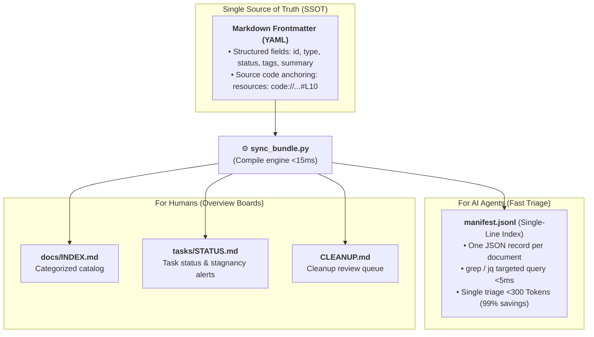
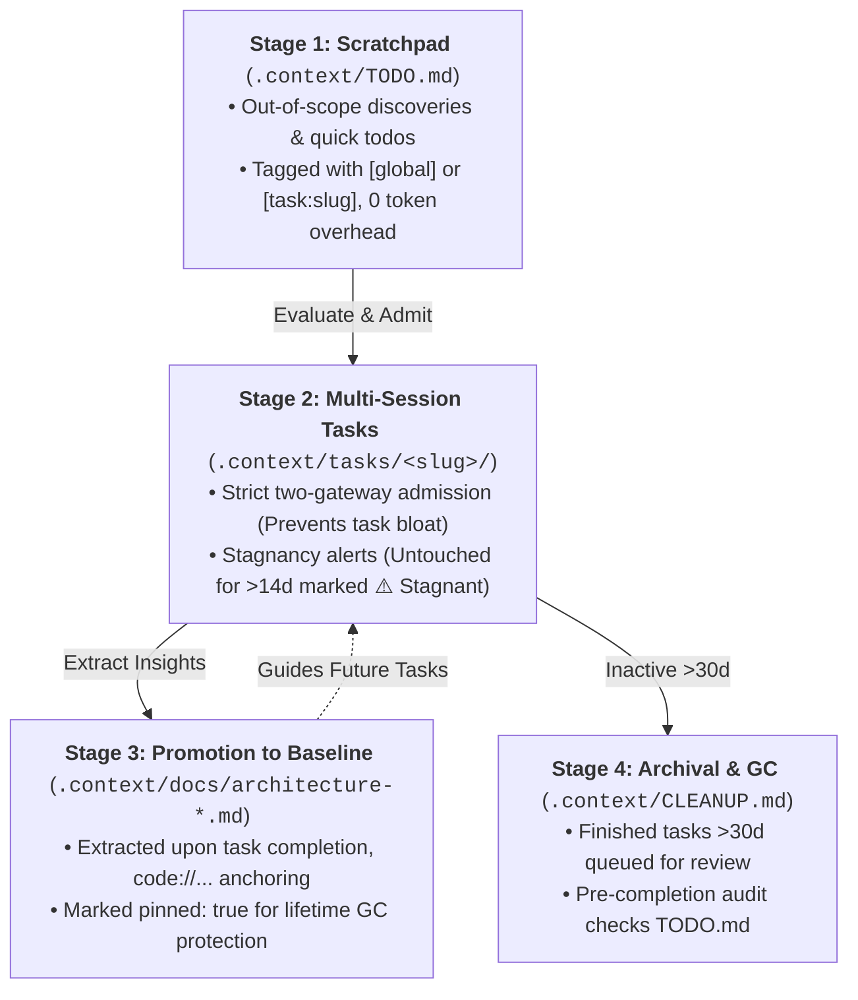

<div align="center">

# 🧠 Agent Context Bundle

**A lightweight local project memory for AI coding agents (Claude Code, Cursor, etc.)**  
*Zero Git pollution • Save 99% tokens • Stop context amnesia • No database required*

<p align="center">
  <a href="README_EN.md">English</a> •
  <a href="README.md">简体中文</a>
</p>

[](LICENSE)
[](#-core-architecture)
[](#-token-budget--performance)
[](#-multi-agent--hook-matrix)

<p align="center">
  <a href="#-the-problem--solution">The Problem</a> •
  <a href="#-core-architecture">Architecture</a> •
  <a href="#-the-4-stage-knowledge-funnel">Knowledge Funnel</a> •
  <a href="#-quick-start">Quick Start</a> •
  <a href="#-token-budget--performance">Token Budget</a> •
  <a href="#-multi-agent--hook-matrix">Hook Matrix</a> •
  <a href="#-faq--design-decisions">FAQ</a>
</p>

</div>

---

## ⚡ The Problem: The AI Agent Context Paradox

As AI coding assistants evolve from single-turn autocomplete to autonomous multi-session agents (e.g., Claude Code, Google Antigravity, Cursor, OpenAI Codex), they generate massive amounts of high-value ephemeral knowledge:

- 🏗️ **Architecture & Investigation Notes**: Deep system invariants, root-cause analyses, latency profiles.
- 🤝 **Cross-Session Continuity**: State preservation across disjointed prompts, model reboots, and multi-day tasks.
- 🔬 **Disposable Validation Assets**: One-off reproduction scripts, benchmark logs, and traces.

### The Traditional Dilemma
| Approach | Critical Flaws |
|---|---|
| **Direct Git Commits** | Pollutes repository git history and pull requests with noise, personal scratchpads, and rapid temporary revisions. |
| **Unstructured Local Notes** | Files rot silently; agents suffer context amnesia between sessions; no state machine or freshness tracking. |
| **External Vector DB / SaaS** | Proprietary lock-in, complex daemon setup, out-of-band state drift, and invisible to human developers viewing the repository. |

### The Solution: `Agent Context Bundle`
A standardized `.context/` workspace governed by an ultra-lightweight compile-time engine (`sync_bundle.py`). It turns local markdown notes into a **queryable, self-healing knowledge graph** that:
1. **Loads in <5ms** with 99% token savings via single-line JSONL streaming (`manifest.jsonl`).
2. **Never rots** through automated activity tracking, stagnancy alerts, and lifecycle garbage collection.
3. **Never gets lost** by anchoring directly to exact source code lines (`code://path/to/file.go#L42-L80`).

---

## 📐 Core Architecture



### Architectural Principles

1. **Zero External Dependencies**: 100% pure Markdown and YAML frontmatter. Zero external databases, zero background daemon processes, zero vendor SDKs.
2. **Concept as ID**: Every file represents a discrete Concept; its relative path without extension serves as its canonical ID (e.g., `docs/architecture-gateway`, `tasks/token-migration`).
3. **Bi-Directional Knowledge Topology**:
   - **Horizontal (Doc $\leftrightarrow$ Doc)**: Standard relative Markdown links (`[Session Cache](architecture-cache.md)`).
   - **Vertical (Doc $\rightarrow$ Code)**: Explicit line-range anchoring (`code://src/auth/jwt.go#L42-L80`).
4. **Frontmatter as Single Source of Truth (SSOT)**: Files own their metadata. The index (`manifest.jsonl`) and summary boards (`INDEX.md`, `STATUS.md`, `CLEANUP.md`) are 100% derived artifacts—rebuilding takes 15ms.
5. **Flexible Git Strategy (Dual-Mode)**:
   - **Team-Shared Mode (Default)**: Granular `.gitignore` keeps architecture specs and `manifest.jsonl` committed to Git while ignoring local logs.
   - **Local Sandbox Mode**: Global `.gitignore` isolates the entire `.context/` directory for pure personal local use.

---

## 🗂️ Standard Workspace Skeleton

```text
.context/
├── AGENTS.md                         # Workspace rules & L1/L2/L3 progressive discovery SOP
├── TODO.md                           # Stage 1: Lightweight attributed scratchpad (Zero token overhead)
├── manifest.jsonl                    # [Generated Index] Compact single-line JSON index for agent triage
├── CLEANUP.md                        # [Generated Board] Automated cleanup review candidates (>30d inactive)
├── docs/                             # Stage 3: Long-term core baseline knowledge
│   ├── INDEX.md                      # [Generated Board] Auto-categorized documentation catalog
│   ├── architecture-<slug>.md        # Living architecture designs & ADRs (no date suffix)
│   ├── playbook-<slug>.md            # Standard debugging & operational runbooks (no date suffix)
│   └── handoff-<slug>-<YYYYMMDD>.md  # Time-stamped session transitions
├── tasks/                            # Stage 2: Multi-session complex tasks
│   ├── REGISTRY.md                   # Strict task admission log (Prevents task explosion)
│   ├── STATUS.md                     # [Generated Board] Task status, age, & stagnancy alerts
│   └── <task-slug>/
│       ├── README.md                 # Task controller (Frontmatter with status & code anchors)
│       ├── progress.md               # Append-only chronological execution log (Auto-split at ~200 lines)
│       └── (optional) plans/ docs/   # Sub-plans & task-specific design documents
├── research/                         # Multi-session evaluations, benchmarks & spike investigations
└── scripts/
    ├── sync_bundle.py                # Dual-layer index compiler & graph validator (<15ms)
    ├── bump_updated.py               # Atomic frontmatter 'updated:' date renewer
    └── install_git_hook.sh           # Pre-commit hook installer (Smart gitignore-aware)
```

---

## 🌪️ The 4-Stage Knowledge Funnel

The bundle implements a lifecycle state machine that solves both **context loss** and **knowledge rot**:



### 1. Stage 1: Lightweight Scratchpad (`TODO.md`)
- **Purpose**: Zero-friction scratchpad for quick ideas and out-of-scope discoveries.
- **Strict Scope Attribution**: Every bullet must state its scope:
  ```markdown
  - [ ] [global] Makefile: Add local docker-compose benchmark target
  - [ ] [task:auth-refactor] src/auth/jwt.go#L42: Fix unhandled token expiration edge case
  ```
- **Indexing Exemption**: Ignored by `sync_bundle.py`. Never pollutes `manifest.jsonl`.

### 2. Stage 2: Active Task Execution (`tasks/<slug>/`)
- **Strict Two-Gateway Admission**: New tasks are **never** created arbitrarily by agents. Admission requires:
  1. *User Explicit Command*: The developer directly requests a new task.
  2. *Agent Proposal + Human Approval*: The agent proposes splitting an oversized task and waits for user consent.
- **Controller & Log Separation**:
  - `README.md`: Controller holding frontmatter, goals, code anchors, and key decisions.
  - `progress.md`: Append-only execution log. Editing this file automatically redirects the date bump to `README.md`.
- **Automatic Log Chunking**: When `progress.md` exceeds ~20-30 entries, historical entries are split into `progress-archive-YYYYMMDD-YYYYMMDD.md` with an inline executive summary.

### 3. Stage 3: Long-term Core Knowledge (`docs/`)
- **Baseline Promotion**: When a task concludes, architectural insights and reusable runbooks are promoted to `docs/architecture-<slug>.md` or `docs/playbook-<slug>.md`.
- **Code Anchoring**: Frontmatter references exact code ranges:
  ```yaml
  ---
  type: architecture
  title: Distributed Session Cache Architecture
  status: active
  resources:
    - code://src/cache/redis_cluster.go#L45-L120
  summary: Multi-tier local LRU + Redis cluster session management
  pinned: true
  ---
  ```

### 4. Stage 4: Lifecycle Governance (`CLEANUP.md`)
- **Automated Garbage Collection**: Any item with `status: completed | resolved | archived` untouched for **>30 days** is queued in `CLEANUP.md`.
- **Task Completion Audit**: Before completing a task, the agent runs `grep 'task:<slug>' .context/TODO.md` to prevent orphaned side-tasks.

---

## 🚀 Quick Start

### 1. Installation

#### As a Claude Code / AGY Skill (Recommended)
Clone directly into your personal agent skills directory:
```bash
git clone https://github.com/weiiWill/agent-context-bundle.git ~/.claude/skills/agent-context-bundle
```

#### For Local Skill Development
```bash
ln -s /path/to/agent-context-bundle ~/.claude/skills/agent-context-bundle
```

### 2. Initializing in a Project
Prompt your agent in any workspace:
> *"Initialize an Agent Context Bundle in this project."*

The isolated Sub-agent will:
1. Scaffold `.context/{docs,research,tasks,scripts}` and inject starter templates.
2. Configure Git integration:
   - **Team-Shared (Recommended)**: Ignores `TODO.md` and runtime logs; tracks `docs/`, `tasks/README.md`, and `manifest.jsonl`.
   - **Local-Only**: Excludes `.context/` globally.
3. Install platform-specific hooks and compile the initial `manifest.jsonl`.

---

## ⚡ Multi-Agent & Hook Matrix

Zero manual updates. Hooks guarantee that any file modification automatically refreshes dates and recompiles indexes in under 15ms.

```text
Edit .context/file.md ──► PostToolUse Hook ──► bump_updated.py ──► sync_bundle.py ──► manifest & boards updated
```

### 1. Claude Code (`.claude/settings.local.json`)
```json
{
  "hooks": {
    "PostToolUse": [
      {
        "matcher": "Write",
        "hooks": [{
          "type": "command",
          "if": "Write(.context/**)",
          "command": "jq -r '.tool_input.file_path // .tool_response.filePath // empty' | { read -r f; [ -n \"$f\" ] && python3 .context/scripts/bump_updated.py \"$f\"; python3 .context/scripts/sync_bundle.py; } 2>/dev/null || true",
          "statusMessage": "🔄 Syncing .context/ bundle"
        }]
      },
      {
        "matcher": "Edit",
        "hooks": [{
          "type": "command",
          "if": "Edit(.context/**)",
          "command": "jq -r '.tool_input.file_path // .tool_response.filePath // empty' | { read -r f; [ -n \"$f\" ] && python3 .context/scripts/bump_updated.py \"$f\"; python3 .context/scripts/sync_bundle.py; } 2>/dev/null || true",
          "statusMessage": "🔄 Syncing .context/ bundle"
        }]
      }
    ]
  }
}
```

### 2. Google Antigravity (`.agents/hooks.json`)
```json
{
  "context-bundle-sync": {
    "PostToolUse": [
      {
        "matcher": "write_to_file",
        "hooks": [{ "type": "command", "command": "python3 .context/scripts/sync_bundle.py 2>/dev/null || true" }]
      },
      {
        "matcher": "replace_file_content",
        "hooks": [{ "type": "command", "command": "python3 .context/scripts/sync_bundle.py 2>/dev/null || true" }]
      }
    ]
  }
}
```

### 3. Smart Git Pre-Commit Hook (`install_git_hook.sh`)
- Run `bash .context/scripts/install_git_hook.sh` to install `.git/hooks/pre-commit`.
- **Intelligent Gitignore Awareness**: If `.context/` is globally ignored, the hook automatically detects this and safely exits. If tracked, it automatically stages refreshed indexes on commit.

### 4. VSCode / Cursor IDE Schema Validation
Reference `reference/schema/context-frontmatter.schema.json` in `.vscode/settings.json` for full IntelliSense and schema validation:
```json
{
  "yaml.schemas": {
    "./.context/schema/context-frontmatter.schema.json": [
      ".context/docs/**/*.md",
      ".context/tasks/*/README.md"
    ]
  }
}
```

---

## 📊 Token Budget & Performance

### Token Efficiency Benchmark
In a typical repository with 30 architecture docs, 5 active tasks, and 10 research notes:

| Retrieval Method | Data Read | Context Overhead | Retrieval Latency |
|---|---|---|---|
| **Raw Markdown Dumps** | 45 files (~5 KB each) | ~75,000 tokens | ~1,200 ms |
| **Full `INDEX.md` Boards** | 3 board files | ~4,500 tokens | ~150 ms |
| **`manifest.jsonl` (Targeted `grep`/`jq`)** | 3-5 lines of JSON | **< 300 tokens (99% savings)** | **< 5 ms** |

### Indexing Engine Benchmarks
- **Scan & Compile Speed**: <15ms for 100 documents on standard developer hardware.
- **Memory Footprint**: <12MB resident Python process memory.
- **Fail-Open Design**: Scripts exit with code 0 under non-critical parsing errors to prevent blocking tool invocations.

---

## ❓ FAQ & Design Decisions

<details>
<summary><b>Why not use a local SQLite or Vector Database?</b></summary>
<br>
Vector databases and embedded SQL engines introduce binary blobs, background daemon dependencies, schema migration headaches, and opacity to human engineers. Markdown + JSONL provides zero-lock-in, native Git diffing, instant human inspection, and sub-5ms query performance via standard Unix utilities (<code>grep</code>, <code>jq</code>).
</details>

<details>
<summary><b>Why single-line JSONL over a single formatted JSON array?</b></summary>
<br>
With a JSON array (<code>[...]</code>), an agent or tool must parse the entire file into memory to evaluate a single field. With <code>manifest.jsonl</code>, agents can stream and filter records line-by-line using standard POSIX pipes without reading the rest of the file into context:
<pre><code>grep '"type": "architecture"' .context/manifest.jsonl | jq -r '.id'</code></pre>
</details>

<details>
<summary><b>How does this prevent task explosion and stale files?</b></summary>
<br>
Task creation is restricted by strict admission gateways (user command or human-confirmed split). In addition, <code>sync_bundle.py</code> marks any in-progress task untouched for >14 days with <code>⚠️ Stagnant (>14d)</code> and flags finished tasks untouched for >30 days in <code>CLEANUP.md</code>.
</details>

---

## 📄 License

Distributed under the [MIT License](LICENSE). Copyright © 2026 WeiiWill.
